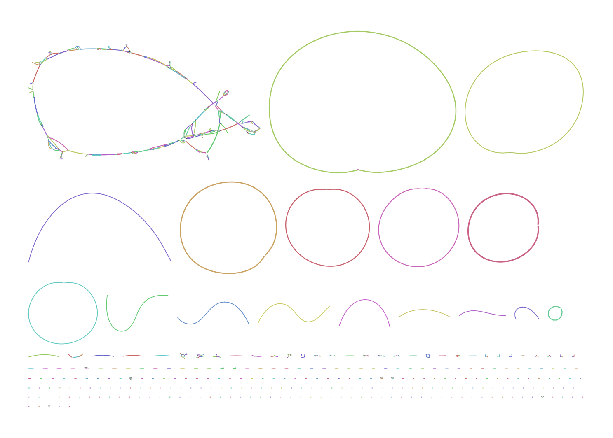

Metagenomic assembly using metaFlye
===================================

This tutorial is a part of the Long read sequencing workshop, held at
The Jackson Laboratory for Genomic Medicine in May 2022. Presented
by Mikhail Kolmogorov.

Prerequsites
------------

The tutorial requires a Linux or Mac machine with at least 16 Gb of RAM and 5 Gb disk space.
You can use either a laptop/desctop or remote computational server. If you are using 
a server, you will need to copy assembly results back to the local machine
to visualize them using Bandage and Quast.

If you don't have it already, download and install bioconda as described [here](https://bioconda.github.io/user/install.html).

Instal the required tools in a separate environemnt

```
conda create -n jax-meta-tutorial flye=2.9 quast bandage
conda activate jax-meta-tutorial
```


Assembling mock bacterial community from ONT data
-------------------------------------------------

In this part, we will be using Oxford Nanopore sequencing of a mock bacterial
community, originally published by [Nicholls et al.](https://academic.oup.com/gigascience/article/8/5/giz043/5486468).
We will be using the version with even bacterial distribution. The community also contains
two yeast genomes, but we will ignore them for the sake of simplicity.

For the convenience, I am providing a downsampled version of the dataset
(total read size ~1Gb) that was also re-basecalled with the recent
basecaller (Guppy 5).

To download reads, use:

```
wget XXX_zendo/Nicholls_ont_guppy5_1gb.fastq.gz
```

Then, run metaFlye as follows:

```
flye --nano-hq Nicholls_ont_guppy5_1gb.fastq.gz -o flye_ont -t 30 --meta
```

This step may take considerable time, depending on the available resorces.
Feel free to adjust `-t` parameter accoding to the number of CPUs on your machine.
Using 30 threads, it takes about 30 minutes to run the assembly.

Once assembly is done, time to visualize it! Open `flye/assembly_graph.gfa`
using `Bandage`. If you were using a remote server for computation, you'll need
to download the graph file to local machine first.

This is how your assembly might look like, visualized by Bandage:


Notice multiple circular chromosomes, that likely correspond to
complete bacterial genomes. There are also two pairs of bacterial
genomes that have shared long repeats that were unresolved.
Because of that, these genomes are "glued" on the graph, instead of forming
separate circular contigs.

Can we verify that the assemblies indeed represent
the correct genomes? Yes, because we are lucky to have reference
genomes for this particular community.

Download and extract reference genomes as follows:

```
wget ZENODO_Nicholls_ont_refs.tar.gz
tar -xvf Nicholls_ont_refs.tar.gz
```

Now, use metaQUAST to analyze the assembly:

```
metaquast.py flye_ont/assembly.fasta -R Nicholls_ont_refs -o quast_ont
```

The best way to look at Quast results is though their interactive web browser report.
You can open `quast_ont/report.html` to do that. Alternatively, you can examine
the text report as follows. First of all, let's look at genome completion rates:

```
cat quast_ont/summary/TXT/Genome_fraction.txt 
```

Which outputs:
```
Assemblies           assembly
155_P.aeruginosa     99.998  
220_E.coli           100.000 
227_S.enterica       99.930  
445_S.aureus         99.726  
464_E.faecalis       100.000 
516_B.subtilis       99.797  
525_L.monocytogenes  99.963  
528_L.fermentum      100.000 
```

All bacteria have 99%+ sequence recovered, nice!

Next, let's check base-level accuracy. You can see the number
of indels and missmatches for each bacteria here:

```
cat quast_ont/summary/TXT/num_indels_per_100_kbp.txt
cat quast_ont/summary/TXT/num_mismatches_per_100_kbp.txt
```

For example, for `L.monocytogenes`, the total number of
mismatches + indels is about 10 per 100kb, which translates
into ~QV40. Not bad!

Finally, let's check the contiguity. A common way to measure
it though NGA50/LGA50 stististics. LGA50 gives you the minimum number 

Assembling mock bacterial community from PacBio HiFi data
---------------------------------------------------------

The previous mock community consisted of different bacterial species
and mostly different genera. In a real metagenome, we commonly see many
closely-related species or strains. To model this, PacBio
recently released [HiFi sequencing](https://www.ncbi.nlm.nih.gov/sra/SRR13128014) 
of mock bacterial community with 5 E.coli strains, among other species. Let's give it a try!

As before, I've prepared a downsampled version here:

```
wget XXX_SRR13128014_hifi_1gb.fastq.gz
```

Assembly using metaFlye's hifi mode:

```
flye --pacbio-hifi SRR13128014_hifi_1gb.fastq.gz -o flye_hifi -t 30 --meta
```

If you visualize the assembly with Bandage as before, you'll notice that some
tangled components, in addition to nicely assembled circular chromosomes.



Similarly, you can run QUAST analysis with the following references:
```
wget YYY_SRR13128014_refs.tar.gz
```
